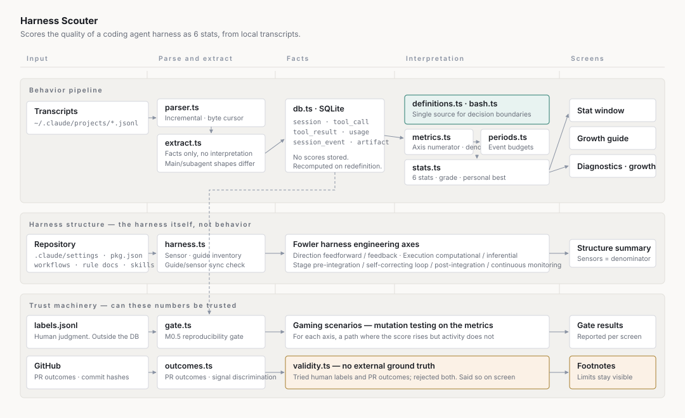

# Harness Scouter

[한국어](README.md) · [English](README.en.md) · [日本語](README.ja.md)

Turns the Claude Code transcripts sitting on your machine into 6 stats that measure **the quality of a coding agent harness**. It shows them as a character stat window rather than a report, and tells you how to raise the low ones.

What gets measured is the **harness**, not the model. The same model gives different results depending on how the prompts, context, hooks, and skills were put together, and this tool tries to measure that difference.

```
  HARNESS SCOUTER  all-time         Lv. 71  B
  2026-07-02 ~ 2026-08-10 · 366 sessions · 30 history windows · coverage 82%
  ────────────────────────────────────────────────────────────────────────────────
  Retrieval          ████████████░░░░░░░░░░░░  52  C   typical   46~59  best  67
      File-finding discipline     21   n= 1604
      Index-first retrieval       45   n= 5608
      Evidence before edit        91   n= 1861
  Verification       ████████████████████░░░░  81  A   typical   75~89  best  99
      Pre-commit check freshness  84   n=  415
      No redundant checks         78   n= 2131
  Delivery           █████████████████████░░░  88  A   typical   86~93  best  98
      Reached an artifact         91   n=  178  (display)
      No rework                   88   n= 6774
  Autonomy           ██████████████████████░░  90  S   typical   85~96  best 100
      No human intervention       90   n=78760
  Discipline         ████████████████░░░░░░░░  65  B   typical   69~78  best  93
      Instrumented-channel use    59   n=11414
      No repeat gate hits         71   n= 2142
  Context efficiency ████████████████░░░░░░░░  68  B   typical   64~72  best  83
      Read-scope discipline       60   n= 2765
      Recall of what was read     92   n=13977
      Response brevity            56   n=25391
      Context lightness           64   n=51374
  ────────────────────────────────────────────────────────────────────────────────
  Overall 70.9 · B  (7.1p to the nearest grade cut)
  All-time aggregate, so grades come from absolute scores. Drop --all for per-period grades.
```

The useful part is not the number itself but **which component is the bottleneck**. In the screen above, Retrieval 52 comes down to one thing, `File-finding discipline 21`, and fixing it takes Retrieval from 52 to 78. That is how I used it while building this tool.

There is no external evidence yet that these scores correlate with actual quality. Read [Known limitations](#known-limitations) first to decide how far to trust them.

## Architecture



Three tracks run separately.

**The behavior pipeline** pulls only facts out of the transcripts into SQLite, and recomputes the scores every time. The structure exists so that changing a definition does not mean reparsing 940MB. That is why there are no scores in `db.ts`.

**The harness structure scan** reads the inventory of sensors and guides out of the repository. Behavior alone cannot tell whether "0 blocks" means the sensors are good or that there are none. The axis names come from Martin Fowler's [harness engineering](https://martinfowler.com/articles/harness-engineering.html).

**The trust machinery** measures whether these numbers can be trusted. The reproducibility gate, the gaming scenarios, and the validity status live here.

## Data

Everything is local. Nothing leaves the machine. The one exception is `scouter outcomes`, the only command that asks GitHub for a list of PRs through `gh`.

```
~/.claude/projects/**/*.jsonl   read-only input. 940MB
~/.harness-scouter/scouter.sqlite   fact tables. 218MB
~/.harness-scouter/labels.jsonl     labels applied by a person
```

`--db` and `--labels` move those locations.

### Why SQLite, and how it is used

It uses the **built-in `node:sqlite`** from Node 22.5. A native module such as `better-sqlite3` gets caught in Electron ABI rebuilds inside the VSCode extension; the built-in module has none of that. That is why the only dependencies are dev tools.

The DB holds **parsed facts only**. No scores.

| Table           | What it holds                                                       | Rows (sample) |
| --------------- | ------------------------------------------------------------------- | ------------- |
| `session`       | Session metadata. Project, branch, model, entry point               | 609           |
| `tool_call`     | Tool calls. Name, command, file path, whether it was blocked, agent | 71,727        |
| `tool_result`   | Tool results. Lines read, edit kind, stdout tail                    | 71,719        |
| `usage`         | Tokens per response. Deduplicated per request                       | 56,954        |
| `session_event` | Interrupts, queued input, tool denials                              | 4,997         |
| `artifact`      | Commits, PRs, commit hashes                                         | 1,473         |
| `file_cursor`   | Per-file mtime and byte position                                    | 2,099         |

**Not storing the axis scores is the core of the design.** Metric definitions change often, and if every change meant reparsing 940MB, the iteration loop would fall apart. Facts are stored; axes are computed every time.

### It is safe to delete

The DB can be thrown away and rebuilt at any time. The transcripts are the original; the DB is derived.

```bash
rm ~/.harness-scouter/scouter.sqlite*
npm run scouter -- scan     # full 940MB reparse, 8s
```

The incremental scan remembers each file's mtime and byte position and reads only the lines appended since. With nothing changed it finishes in under 1 second.

**Labels are kept outside the DB.** Labels are the one input that cannot be pulled out of the transcripts again, and keeping them in the same container as derived data means losing them every time a definition changes. `labels.jsonl` is append-only, so a crash mid-write does not lose what came before, and a person can open and edit it directly.

## Install

### Single binary (no Node)

Attached to the release on every tag. The runtime is bundled, so nothing has to be installed first.

| Platform              | File                          |
| --------------------- | ----------------------------- |
| macOS (Apple Silicon) | `scouter-darwin-arm64.tar.gz` |
| macOS (Intel)         | `scouter-darwin-x64.tar.gz`   |
| Linux (x86_64)        | `scouter-linux-x64.tar.gz`    |

The repository is public, so no authentication is needed. `latest` always points at the newest release.

```bash
case "$(uname -sm)" in
  "Darwin arm64")  T=darwin-arm64 ;;
  "Darwin x86_64") T=darwin-x64 ;;
  "Linux x86_64")  T=linux-x64 ;;
esac
BASE=https://github.com/sean5940/harness-scouter/releases/latest/download
curl -fsSLO "$BASE/scouter-$T.tar.gz"
curl -fsSLO "$BASE/SHA256SUMS"
tar xzf "scouter-$T.tar.gz"
shasum -a 256 -c SHA256SUMS 2>/dev/null | grep OK
./scouter status --all
```

It carries a whole Node runtime, so it is **around 105MB** (35MB compressed). On macOS the signature is ad-hoc, so the first open needs right-click open.

### From source

Node 22.5 or later is required. Because it uses the built-in `node:sqlite` module, **there are no native dependencies.**

```bash
git clone https://github.com/sean5940/harness-scouter.git
cd harness-scouter
npm install
npm run build
npm run scouter -- status --all
```

The `gh` CLI is only needed to see PR outcomes (`scouter outcomes`). Everything else works without it.

## Language

The screen comes in **Korean and English**. The documents are in three languages, picked from the switcher at the top.

```bash
scouter status --all                 # auto-detect
scouter status --all --lang en       # English
scouter status --all --lang ko       # Korean
SCOUTER_LANG=en scouter status --all # pin it through the environment
```

Auto-detection goes **explicit value → `SCOUTER_LANG` → `LC_ALL`/`LC_MESSAGES`/`LANG` → English**. Only the first two letters of the locale are read, so `ko_KR.UTF-8` means Korean.

An unknown language does not pass quietly. It fails, with the list of supported ones.

```
$ scouter status --lang klingon
알 수 없는 언어: klingon (지원: ko, en) / unknown language
```

**The scores are the same in either language.** That means localization did not touch the definitions, and every release checks it by comparing the scores across the two languages.

## Using it on another harness

The metrics are defined by **capability**, not by tool name. Measuring another harness only takes filling in one mapping from names to capabilities.

| Capability       | Claude Code                                  | What it measures                                                              |
| ---------------- | -------------------------------------------- | ----------------------------------------------------------------------------- |
| `file-find`      | `Glob`                                       | Finding file paths                                                            |
| `content-search` | `Grep`                                       | Full scan of content                                                          |
| `index-search`   | qmd · graphify (**both tool and shell CLI**) | Index-based search                                                            |
| `index-fetch`    | the `qmd get` family                         | Pulling out a document already known                                          |
| `file-read`      | `Read`                                       | Reading files                                                                 |
| `file-edit`      | `Edit` · `Write` · `MultiEdit`               | Editing files                                                                 |
| `shell`          | `Bash`                                       | Running a shell                                                               |
| `subagent`       | `Agent` · `Task`                             | Delegation                                                                    |
| `other`          | `TodoWrite`, `AskUserQuestion`, and so on    | Not seen by the axes. **Listed explicitly to keep it apart from the unknown** |

**The shell column is the crux.** Calling through a tool and calling through the shell do the same work, and not looking at the shell loses the whole of actual usage. In this repository 1,220 graphify CLI calls were once seen as 4. 1/300 of actual use.

### A missing capability is not a 0, it is no verdict

Matching names is not enough. Measure a harness that has **no index search tool at all** and the numerator is 0 while the denominator fills up with `grep`, which comes out as a 0 — but that is not "had it and did not use it", it is "does not have it".

```
harness with no index tool  Content index first       no verdict   ← not a 0
                            Read range discipline     measured
shell-only harness          Instrumented channel use  no verdict
                            Read range discipline     no verdict
```

**It comes out as no verdict even when the denominator is not 0.** The denominator gets filled by the fallback path, so the denominator alone cannot show a missing capability.

Which capabilities an axis needs to hold is in `AXIS_REQUIRES`. If the profile does not have them, that axis drops out of the average, and **how many components the score came from is shown along with it.**

```
Exploration  100
    File-finding discipline  no verdict
    Content index first      100
    Read before edit         no verdict
    scored from 1 of 3 components
```

A session that fixed nothing and only repeated index searches really does come out like this. Instead of forcing the score down, it states **what the score was made of.**

### Unknowns make noise

A mapping table goes stale sooner or later. So it also measures how much of what is observed the profile covers.

```
71,727 tool calls observed
  mapped to a capability  71,714  100.0%
  unmapped                    13    0.0%
```

**When coverage drops under 90% it does not give a score, it shows what was not caught.** Someone else's harness does not come out at 0, it comes out as "`read_file` is unknown".

The heart of the graphify accident was not that a name was wrong but that **there was no way to know it was wrong**. The screen said nothing.

## Usage

The first run is a scan. After that it is incremental and takes a few seconds.

```bash
npm run scouter -- scan
# 1,518 of 1,518 files updated / 310,802 entries parsed / 7.7s
```

### Seeing the stats

```bash
npm run scouter -- status --all   # all periods
npm run scouter -- status         # latest period only
```

`--all` merges every period and answers "how am I usually"; without it only the latest period is read, answering "how am I right now".

### Seeing how to raise them

```bash
npm run scouter -- guide --all
```

For each stat it points at the bottleneck component and gives what is counted, why it matters, the behavior that raises it, and **the antipatterns that raise the score without raising quality**.

### Seeing where it leaks

```bash
npm run scouter -- diag --all
```

It lists where large files were read whole, where commits landed without verification, and where files were touched through bash, each with the sessions as evidence. Exploration timeliness (main vs subagent) is here too.

### Seeing the harness structure

```bash
npm run scouter -- harness --root /path/to/repo
```

```
  96 sensors (88 automatic · 8 manual) · 58 guides
  Direction  feedforward 29  ·  feedback 67
  Execution  computational 87  ·  inferential 9
  Stage      pre-integration 3  ·  self-correcting loop 53  ·  post-integration 33  ·  continuous monitoring 7

  Guide/sensor sync   27 kinds of hook found across 323 rule documents
    4 gates that block without explanation: ...
```

### Seeing it as HTML

```bash
npm run scouter -- html --all --root /path/to/repo --out /tmp/scouter.html
```

A hexagonal radar, the stat bars, the grading table, the harness structure, the growth guide, and an early-half against recent-half comparison all fit on one page. It follows the viewer's light and dark themes.

### Everything else

```bash
npm run scouter -- gate         # M0.5 reproducibility gate
npm run scouter -- strata       # re-run split-half inside work-type strata
npm run scouter -- outcomes     # PR outcomes and signal discrimination (needs gh)
npm run scouter -- periods      # list of periods
npm run scouter -- json         # JSON for the extension
```

## Letting the agent read it directly (MCP)

An agent can read the quality of its own harness **mid-session**. Unlike a dashboard a person looks at after the fact, this reaches the moment of action.

Put it in `.mcp.json` or the Claude Code settings.

```json
{
  "mcpServers": {
    "harness-scouter": {
      "command": "node",
      "args": ["/path/to/harness-scouter/packages/mcp/dist/index.js"],
      "env": { "SCOUTER_LANG": "en" }
    }
  }
}
```

| Tool              | What it gives                                                   |
| ----------------- | --------------------------------------------------------------- |
| `scouter_status`  | The current stats and the score of each component               |
| `scouter_guide`   | The behavior that raises a low stat · **antipatterns included** |
| `scouter_diag`    | Where it leaks (with the sessions as evidence)                  |
| `scouter_harness` | The sensor and guide inventory and the sync check               |
| `scouter_gate`    | Which axes hold up which screen                                 |

**Everything is read-only.** Writing labels and modifying the DB are not exposed.

`scouter_guide` carrying the antipatterns **in the same response** is deliberate. The moment something reads its own score and moves to raise it, the incentive to game it appears, and only putting the prescriptions that raise the score without raising quality right beside it makes that visible at the moment of action.

It handles stdio JSON-RPC directly instead of going through an SDK, so **there are no runtime dependencies.**

## How to read the screen

### Stats and components

| Stat               | What it asks                                             | Components                                                                               |
| ------------------ | -------------------------------------------------------- | ---------------------------------------------------------------------------------------- |
| Exploration        | When it has to find something, does it use the right way | File-finding discipline · Content index first · Read before edit                         |
| Verification       | Does it check before it claims                           | Pre-commit verification freshness · No verification spin                                 |
| Completion         | Does it get all the way to an artifact                   | Artifact reached · No rework                                                             |
| Autonomy           | Does it finish without a person stepping in              | No human intervention                                                                    |
| Discipline         | Does it stay on the agreed rules and tool paths          | Instrumented channel use · No gate repeats                                               |
| Context efficiency | Does it read only as much as it needs and save tokens    | Read range discipline · Remembering what was read · Response brevity · Context lightness |

Each stat is the average of its components. Components with no denominator drop out.

### Bars and markers

```
Exploration   █████████████░░░░░░░░░░░  53  C   typical 46~58  best 67
```

- **The filled bar** is the current value, **typical** is p25~p75 of my own history, and **best** is my personal record.
- **The grade** is an absolute score for all periods, and a percentile against my own history per period.
- In HTML each component carries a `±` marker. It says how little that value moved across history, and larger is more trustworthy.

The target is the **personal best** because there is no basis for an absolute threshold. A value hit once is a target the data proves this harness can reach.

### Grading basis — can this be used on someone else's harness

Each component comes with the type of its target and how comparable it is.

| Target type            | Meaning                                                                                   |
| ---------------------- | ----------------------------------------------------------------------------------------- |
| `100 is the goal`      | Whatever is missing is a defect. Absolute comparison works                                |
| `higher is better`     | There is no basis for setting 100 as the goal. Only rank comparison means anything        |
| `beware both extremes` | Both ends can be bad, so this is not a maximization target. Left out of the overall score |

| Contamination flag             | Meaning                                                                                    |
| ------------------------------ | ------------------------------------------------------------------------------------------ |
| `hook installs move the value` | Blocked calls drop out of the axis, so the more defenses you lay down the higher the score |
| `tied to tool names`           | On a harness with different tool names, that activity drops out of the count entirely      |
| `depends on task mix`          | It measures what got done that day, not the person                                         |

**If a component carries even one contamination flag, it is not used to compare people.** Right now **all 14** components carry one. This tool cannot yet be used to compare against anyone else.

The most common flag is `tied to tool names`. The capability layer resolves the name mapping and splits a missing capability out as no verdict, but that does not make the contamination go away. The anchor values (1,000/4,500 tokens, 100K/400K context) are fitted to the distribution of this corpus, so there is no basis for measuring another harness on the same scale.

### Per-component definitions

What is counted (numerator and denominator), where the target comes from, and what breaks comparison. `scouter guide` gives the same content in bottleneck order.

| Stat               | Component                         | What is counted                                                                                                                                                                             | Target                   | Contamination              |
| ------------------ | --------------------------------- | ------------------------------------------------------------------------------------------------------------------------------------------------------------------------------------------- | ------------------------ | -------------------------- |
| Exploration        | File-finding discipline           | Share of file-path lookups that went through the `Glob` tool. `find … -name` is the rest of the denominator                                                                                 | 100 is the goal          | hook installs · tool names |
| Exploration        | Content index first               | Share of content and relationship lookups that went through qmd or graphify. Counts both MCP and CLI; read and diagnostic calls (`qmd get`, `graphify stats`) are not searches and come out | higher is better         | hook installs · tool names |
| Exploration        | Read before edit                  | Share of edits to existing code files where the file was read first. A newly created file has nothing to read and comes out of the denominator                                              | **100 is the goal**      | tool names                 |
| Verification       | Pre-commit verification freshness | Share of code-touching commits where verification ran **after** the last edit                                                                                                               | higher is better         | task mix · tool names      |
| Verification       | No verification spin              | Inverse of verifier calls that re-ran the same kind with no edit in between                                                                                                                 | higher is better         | task mix                   |
| Completion         | Artifact reached                  | Share of code-touching sessions that got as far as a commit or a PR                                                                                                                         | higher is better         | task mix                   |
| Completion         | No rework                         | Inverse of editing the same file again after skipping verification or a commit                                                                                                              | higher is better         | tool names                 |
| Autonomy           | No human intervention             | Interventions per 100 assistant turns. Interrupts, queued input mid-run, and tool denials counted together                                                                                  | **beware both extremes** | task mix                   |
| Discipline         | Instrumented channel use          | Share of edits and bash file access that went through instrumented tools. `cat`, `awk`, interpreter reads and `sed -i`, heredoc writes are the numerator                                    | higher is better         | tool names                 |
| Discipline         | No gate repeats                   | Share of blocked calls where the same agent did not hit a gate it had already hit. With no blocks there is no denominator and no verdict                                                    | higher is better         | hook installs              |
| Context efficiency | Read range discipline             | Share of reads of files over 200 lines that specified a range. A range covering the whole file does not count                                                                               | higher is better         | tool names                 |
| Context efficiency | Remembering what was read         | Share of reads that did not read the same file again. Re-checking after an edit is legitimate and comes out                                                                                 | higher is better         | tool names                 |
| Context efficiency | Response brevity                  | Output tokens generated per read or edit call. 1,000 tokens is full marks, 4,500 tokens is 0                                                                                                | higher is better         | tool names · task mix      |
| Context efficiency | Context lightness                 | Cached context carried along on every request. 100K is full marks, 400K is 0                                                                                                                | higher is better         | tool names                 |

**What comes out of the denominator is half the definition.** `find -type d` and counting, which `Glob` cannot stand in for; a new file with nothing to read; the legitimate re-check after an edit — leave those in the denominator and the score drops every time there is no alternative, which closes off the honest path.

Only two components are `100 is the goal`. For the rest there is no basis for setting 100 as the target, and forcing a ceiling would make bad behavior pay off instead (padding the artifact rate with empty commits, reading files whole to remove revisits).

## What the design holds to

**Facts are kept apart from interpretation.** The DB holds parse results only, and the axes are recomputed every time, because definitions change often.

**Decision boundaries are pinned in code.** When they lived in prose alone, recomputing the same axis gave a different value each time. Now `definitions.ts` and `bash.ts` are the single reference, and the documents point at the code.

**Gaming resistance is applied to the metrics themselves.** Each axis registers the paths where "activity stays the same but the arithmetic gets better", and measures how far the score rises along them. It is the same shape as mutation testing for tests. Each scenario records what stays physically unchanged (the invariant) and which condition in which function gets through (the mechanism).

**Blocked calls come out of the axes.** Leave them in and you get the paradox that the better the gates work, the worse the score.

**Limitations are not hidden.** The footnotes on screen say there is no external evidence, and what was tried and rejected.

## Known limitations

**This is a diagnostic tool, not a report card.** Start with what it can and cannot be used for.

| What it can do                                                              | Example                                              |
| --------------------------------------------------------------------------- | ---------------------------------------------------- |
| Find where my bottleneck is                                                 | `File-finding discipline 21` → move `find` to `Glob` |
| Compare stretches of time under the same definition                         | Early half against recent half                       |
| See which sensors the harness has and where they diverge from the documents | 4 gates that block without explanation               |

| What it cannot do                      | Why                                                                                         |
| -------------------------------------- | ------------------------------------------------------------------------------------------- |
| "We are above the team average"        | Grades are relative to my own history, so there is no comparing with anyone else            |
| "Better than the previous period"      | Correlation between neighboring periods is 0, so noise and improvement cannot be told apart |
| "This score means the quality is good" | There is no external evidence linking score to quality                                      |

Here is why.

### 1. No external ground truth — a scale with no calibration weights

This tool reports "Exploration 53". But **there is no way to check whether 53 is good or bad**, because there is no answer key to say which session actually did better work, the one at 53 or the one at 80. So grades are set against my own history. It answers "better than usual" and cannot answer "is this good".

Two attempts at an answer key, two rejections. Both are recorded with their numbers in `validity.ts`.

| Attempt      | Method                                                               | Why it was rejected                                                                                            |
| ------------ | -------------------------------------------------------------------- | -------------------------------------------------------------------------------------------------------------- |
| Human labels | Mark each session good or bad, 30 collected                          | Needs a person per session so it does not scale, and evaluating someone else's harness would need their labels |
| PR outcomes  | Use the merge and review records already in GitHub as the answer key | The signal does not discriminate, and it came out opposite to the prior hypotheses                             |

Why PR outcomes do not work comes apart into two tables.

```
Signal discrimination (509 PRs in the repo)
  Merged             453/509 merged (89%)   a test almost everyone passes cannot rank anyone
  Changes requested  2/509                  not a signal at all
  Review rounds      median 2               usable
```

```
Prior hypotheses against measurement (written down before looking at the data)
  Higher verification → fewer review rounds   measured +0.201   opposite
  Higher exploration  → fewer comments        measured +0.134   opposite
  The remaining 1                                               direction held

  Largest correlation   Autonomy × comment count 0.286
                        ← the axis declared in advance to have no causal path
```

When the axis nailed down as unrelated ranks 1st, that is not a finding, that is noise.

### 2. Reproducibility gate 2/6 · 1/6 — scoring the odd and even halves

A period holds about 14 sessions. They are split at random into two groups of 7 and scored separately. **It is the same period, so the two scores should come out close** (the way scoring a test's odd questions and even questions separately still shows the same ability).

On 5 of the 6 axes they are not close. That means the period score reflects **"which sessions happened to land in this period"** rather than "I did well in this stretch".

| Screen      | Axes that hold up | Why                                                                      |
| ----------- | ----------------- | ------------------------------------------------------------------------ |
| All periods | 2/6               | Every period is merged, so reproducibility within a period is not needed |
| Per period  | 1/6               | Scores have to reproduce inside a period, and 5 axes fall short          |

Growing the period 2x, 3x, and 4x did not help. The cause looks less like "too few samples" and more like **the work differing too much from session to session**. It amounts to putting a refactoring session, a bug-fix session, and a documentation session in one bucket and taking the average.

Instead of reading a single split, the tool reads **the distribution of 400 random two-way splits**. With 14 sessions in a period there are 1,716 possible splits, and picking one of them to decide by lets luck settle the verdict.

That is what happened. Index-first search passed at 0.505 on a single split, but **the permutation median is 0.264**. It was one lucky split, and that is why support for the per-period screen dropped from 2/6 to 1/6.

### The experiment that separates the causes — stratify by work type

"Sessions do too many different things" is still a guess, because there are two candidates. Either the axis is unstable to begin with, or the two halves get a different work mix when the period is split.

One contrast tells them apart. **Run the same permuted split-half inside the strata only** and the two halves get the same work mix, so if the correlation rises the cause was the mix, and if it stays the cause is the axis itself. `scouter strata` runs that contrast.

Sessions fall into five strata: explore · docs · build · modify · verify. These are not human labels — they are counted from the fact tables that already exist: what was edited (code or not), whether the file was created or changed, and whether the session only verified without editing.

| Result                   | Meaning                                                                  | Next                                            |
| ------------------------ | ------------------------------------------------------------------------ | ----------------------------------------------- |
| Rises above the floor    | What moved the period scores is the work mix that differs between halves | There is a reason to invest in a fixed task set |
| Stays                    | The work mix is not the cause                                            | A task set will not revive this axis            |
| Rises but stays under it | A shift that size also appears when the labels mean nothing              | Do not read it                                  |

How far a shift has to move before it has moved is not readable from the shift alone. So a **placebo stratification** runs alongside: it keeps the stratum sizes and shuffles only which session sits in which stratum, so the split is constrained the same way while the labels lose their meaning. **A shift measured with meaningless labels is the noise floor, and a real shift that does not clear it is not evidence.**

The floor is not as low as it looks. A real shift can land just barely above it, and without the placebo that number reads as "it rose".

One thing the placebo cannot rule out: if work type is a proxy for denominator size, stratifying balanced the denominator, and the shift may be the denominator's rather than the work type's. A probe pins both either way, but what you pin differs.

The two stratum boundaries (create share, verify floor) are arbitrary values. They were not found at a bend in the observations; something had to be cut somewhere. So the variants are run together to see whether the sign of the shift holds. **If the sign flips across variants, the number came from the threshold rather than from stratification and must not be read.**

**This experiment does not change the gate verdict.** The classifier still rests on arbitrary, unvalidated thresholds, and moving the pass line with it would be editing the standard to find a reason to pass.

### Shortfalls come with a prescription

Every axis is a `numerator/denominator`, so the observed wobble can be separated into **real difference** and **sampling noise**.

```
Axis                           Signal/noise   Denominator for 0.5 reliability   Current budget
Instrumented channel use              11.69                                 3               20
Index-first search                     5.37                                 4               10
Read range discipline                  0.86                                 6               10
Read round-trip restraint              0.62                                64               20
Verification spin restraint            0.40                                23               10
Verification freshness                 0.35                                 7               10
```

**The axes that pass the gate are exactly the top two by signal/noise.** Two different methods gave the same answer.

And a shortfall turns into a prescription. `Read round-trip restraint` needs a denominator of 64 for reliability 0.5, and the budget is 20. It is not "this does not reproduce", it is "the budget is three times too small".

### 3. Predictive power across periods is 0 — not skill, just the day's form

For something to be called "skill", a good period should tend to be followed by another good one. Measuring the correlation between neighboring periods (lag-1), 5 of the 6 axes sit near 0. Based on 29 closed periods.

| Axis                        |        1x |     2x |     3x |     4x |
| --------------------------- | --------: | -----: | -----: | -----: |
| Read range discipline       |    -0.046 | -0.339 | -0.434 | -0.793 |
| Read round-trip restraint   |     0.159 | -0.265 | -0.180 | -0.529 |
| Verification freshness      |     0.078 | -0.156 | -0.226 | -0.282 |
| Verification spin restraint |    -0.159 | -0.321 | -0.199 |  0.191 |
| Instrumented channel use    | **0.621** |  0.049 | -0.127 | -0.127 |
| Index-first search          |    -0.082 |  0.147 | -0.211 | -0.368 |

**If this were a sample-size problem, merging periods should push the numbers up, but they go the other way.** Read range discipline reaches -0.793 when merged 4x. That means neighboring periods do not predict each other at any aggregation size, so it is not an item that can be fixed into passing.

Instrumented channel use is the one high value, 0.621 at 1x, and **it collapses to 0.049 the moment periods are merged 2x**. If skill carried over, it would survive merging. This looks like the regularity of a batch of similar work done back to back, picked up as correlation.

So **there is no "up 3 points from the previous period" display.** Those 3 points cannot be told apart from noise. Comparison happens only in large blocks, such as the early half against the recent half.

### 4. Tied to the Claude Code schema

The metrics are **defined by tool name**: "did it use `Glob`", "did it read with `Read`". Carry them as they are to a harness with different tool names and the score comes out 0, not because that harness is bad but because **this tool does not recognize it**.

This repository fell into the same trap once. Counting graphify by its MCP tool name only, **1,220 CLI calls were seen as 4**. 1/300 of actual use.

## Development

```bash
npm run build       # tsc --build
npm test            # vitest run
npm run typecheck
```

152 tests. When you change a definition, change the regression tests with it — the values move, and static checks will not catch that.

```
packages/core   parser · extract · fact tables · metrics · periods · stats · gate · views
packages/cli    scouter commands
packages/ext    VSCode extension (status bar · panel)
```
