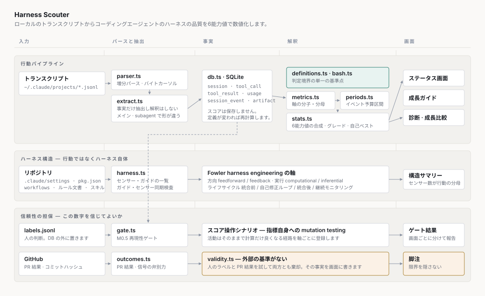

# Harness Scouter

[한국어](README.md) · [English](README.en.md) · [日本語](README.ja.md)

ローカルに溜まった Claude Code のトランスクリプトから、**コーディングエージェントのハーネスの品質**を6つの能力値で数値化します。レポートではなくキャラクターのステータス画面のように見せ、低い能力値を上げる方法も一緒に出します。

測定の対象はモデルではなく**ハーネス**です。同じモデルを使っても、プロンプト・コンテキスト・フック・スキルをどう組んだかで結果が変わるので、その差を測るためのツールです。

```
  HARNESS SCOUTER  全数集計                           Lv. 73  B

  探索力            █████████████░░░░░░░░░░░  53  C   通常 46~58  最高 67
      ファイル探索の規律 21   内容インデックス優先 44   根拠確保率 92
  検証力            ████████████████████░░░░  82  A   通常 74~89  最高 99
      コミット前検証の鮮度 85   検証の空回りなし 80
  完遂力            ██████████████████████░░  91  S   通常 87~94  最高 99
  自律性            ██████████████████████░░  90  S   通常 84~97  最高 100
  規律              ████████████████░░░░░░░░  67  B   通常 69~77  最高 93
  コンテキスト効率  ██████████████████░░░░░░  73  B   通常 68~79  最高 86

  総合 73.2 · B  (最も近いグレードの境界まで 4.8p)
```

数字そのものより**どの構成要素がボトルネックか**が役に立ちます。上の画面で探索力53を作ったのは `ファイル探索の規律 21` ひとつだけで、それを直せば探索力は53から72まで上がります。実際にこのツールを作りながらそう使いました。

このスコアが実際の品質と相関するという外部の根拠はまだありません。[既知の限界](#既知の限界)を先に読めば、どこまで信じてよいかを判断できます。

## アーキテクチャ



三つの流れが別々に回ります。

**行動パイプライン**はトランスクリプトから事実だけを抜いて SQLite に入れ、スコアは毎回計算し直します。定義を直すときに890MBを再パースしないための構造です。`db.ts` にスコアがないのはそのためです。

**ハーネス構造スキャン**はリポジトリからセンサーとガイドの一覧を読みます。行動だけを見ても「ブロック0件」がセンサーが良いからなのか、そもそも無いからなのかが分かれないからです。軸の名前は Martin Fowler の [harness engineering](https://martinfowler.com/articles/harness-engineering.html) から取りました。

**信頼性の担保**はこの数字を信じてよいかを測ります。再現性ゲート、スコア操作シナリオ、妥当性の状態がここにあります。

## データ

すべてローカルにあります。何も外に出ません。例外は `scouter outcomes` ひとつだけで、このときだけ `gh` で GitHub に PR の一覧を問い合わせます。

```
~/.claude/projects/**/*.jsonl   読み取り専用の入力。890MB
~/.harness-scouter/scouter.sqlite   事実テーブル。170MB
~/.harness-scouter/labels.jsonl     人が付けたラベル
```

`--db` と `--labels` で場所を変えられます。

### SQLite を使う理由と使い方

Node 22.5 の**組み込み `node:sqlite`** を使います。`better-sqlite3` のようなネイティブモジュールを使うと VSCode 拡張で Electron ABI の再ビルドに引っかかりますが、組み込みモジュールならその問題がありません。おかげで依存は開発ツールだけです。

DB には**パースした事実だけ**が入ります。スコアはありません。

| テーブル        | 入れるもの                                                               | 行数(例) |
| --------------- | ------------------------------------------------------------------------ | -------- |
| `session`       | セッションメタ。プロジェクト・ブランチ・モデル・エントリポイント         | 424      |
| `tool_call`     | ツール呼び出し。名前・コマンド・ファイルパス・ブロック有無・エージェント | 57,756   |
| `tool_result`   | ツール結果。読んだ行数・編集の種類・stdout の末尾                        | 57,748   |
| `usage`         | 応答ごとのトークン。リクエスト単位で重複排除                             | 46,241   |
| `session_event` | 中断・キュー割り込み・ツール拒否                                         | 4,283    |
| `artifact`      | コミット・PR・コミットハッシュ                                           | 1,387    |
| `file_cursor`   | ファイルごとの mtime とバイト位置                                        | 1,527    |

**軸のスコアを保存しないことが設計の核心です。** 指標の定義がよく変わるのに、定義を直すたびに890MBを再パースしなければならないなら、反復の周期が壊れます。事実だけを貯めておいて、軸は毎回計算します。

### 消しても大丈夫です

DB はいつでも捨てて作り直せます。トランスクリプトが原本で、DB は派生物です。

```bash
rm ~/.harness-scouter/scouter.sqlite*
npm run scouter -- scan     # 890MB 全体を再パース、8秒
```

増分スキャンはファイルごとの mtime とバイト位置を覚えていて、新しく付いた行だけを読みます。変わったものがなければ1秒以内に終わります。

**ラベルは DB の外に置きます。** ラベルはトランスクリプトから取り直せない唯一の入力なのに、派生物と同じ器に置くと定義を一度直すたびに消えます。`labels.jsonl` は append-only なので、書いている途中で落ちても前のものを失わず、人が直接開いて直せます。

## インストール

### 単一実行ファイル (Node なし)

タグごとにリリースへ添付されます。ランタイムが入っているので、事前に何も入れる必要がありません。

```bash
# darwin-arm64 · darwin-x64 · linux-x64
curl -fsSL https://github.com/sean5940/harness-scouter/releases/latest/download/scouter-darwin-arm64.tar.gz | tar xz
./scouter status --all
```

Node のランタイムを丸ごと入れているので**105MB 前後**です。macOS は ad-hoc 署名なので、初めて開くときは右クリックから開く必要があります。

### ソースから

Node 22.5 以上が必要です。`node:sqlite` の組み込みモジュールを使うので**ネイティブ依存がありません。**

```bash
git clone https://github.com/sean5940/harness-scouter.git
cd harness-scouter
npm install
npm run build
npm run scouter -- status --all
```

`gh` CLI は PR の結果を見るときだけ必要です(`scouter outcomes`)。なくても残りは全部動きます。

## 言語

画面は**韓国語と英語**を出します。ドキュメントは3言語で、一番上の切り替え行から選べます。

```bash
scouter status --all                 # 自動判定
scouter status --all --lang en       # 英語
scouter status --all --lang ko       # 韓国語
SCOUTER_LANG=en scouter status --all # 環境変数で固定
```

自動判定は**明示した値 → `SCOUTER_LANG` → `LC_ALL`/`LC_MESSAGES`/`LANG` → 英語**の順です。ロケールは先頭の2文字だけを見るので、`ko_KR.UTF-8` なら韓国語です。

知らない言語を渡すと黙って通さず、サポートする一覧と一緒に失敗します。

```
$ scouter status --lang klingon
알 수 없는 언어: klingon (지원: ko, en) / unknown language
```

**言語を変えてもスコアは同じです。** 多言語化が定義に触れていないという意味で、リリースごとに2言語のスコアを突き合わせて確認します。

## 他のハーネスに使う

指標はツール名ではなく**能力**で定義されています。他のハーネスを測るには、名前から能力へ向かうマッピングを一つ埋めるだけで済みます。

| 能力             | Claude Code                                    | 何を測るか                                       |
| ---------------- | ---------------------------------------------- | ------------------------------------------------ |
| `file-find`      | `Glob`                                         | ファイルパスを探す                               |
| `content-search` | `Grep`                                         | 内容の全数スキャン                               |
| `index-search`   | qmd · graphify (ツール・**シェル CLI の両方**) | インデックスベースの検索                         |
| `index-fetch`    | `qmd get` 系                                   | 既に知っている文書を取り出す                     |
| `file-read`      | `Read`                                         | ファイルを読む                                   |
| `file-edit`      | `Edit` · `Write` · `MultiEdit`                 | ファイルを直す                                   |
| `shell`          | `Bash`                                         | シェルの実行                                     |
| `subagent`       | `Agent` · `Task`                               | 委譲                                             |
| `other`          | `TodoWrite` · `AskUserQuestion` など           | 軸は見ない。**知らないものと区別するために明示** |

**シェルの欄が核心です。** ツールで呼んでもシェルで呼んでも同じ仕事をしたのに、シェルを見なければ実際の使用量を丸ごと取りこぼします。このリポジトリで graphify の CLI 呼び出し 1,220件を4件と見ていたことがあります。実際の使用量の300分の1です。

### 知らないものには音が鳴ります

マッピング表はいつでも古くなります。そのため、プロファイルが観測をどれだけ覆っているかも一緒に測ります。

```
観測したツール呼び出し 57,756件
  能力にマッピング済み  57,749  100.0%
  未マッピング               7    0.0%
```

**カバレッジが90%を下回るとスコアを出さず、何が捕まえられなかったかを見せます。** 他人のハーネスで0点が出るのではなく、「`read_file` を知りません」が出ます。

graphify の事故の本質は、名前を間違えたことではなく**間違えたと気づけなかった**ことでした。画面は何も言いませんでした。

## 使い方

最初の実行はスキャンです。以降は増分なので数秒で終わります。

```bash
npm run scouter -- scan
# ファイル 1,518個中 1,518個を更新 / エントリ 310,802件をパース / 7.7秒
```

### 能力値を見る

```bash
npm run scouter -- status --all   # 全数集計
npm run scouter -- status         # 最新区間のみ
```

`--all` はすべての区間を合わせて「普段どうか」に答え、なければ最新区間だけを見て「今どうか」に答えます。

### 上げ方を見る

```bash
npm run scouter -- guide --all
```

能力値ごとにボトルネックの構成要素を指し、何を数えるか・なぜ重要か・上げる行動・**スコアだけ上がって品質は上がらないアンチパターン**を出します。

### どこで漏れているかを見る

```bash
npm run scouter -- diag --all
```

大きいファイルを丸ごと読んだ場所、検証なしにコミットされた場所、bash でファイルを触った場所を、根拠となるセッションと一緒に出します。探索の適時性(メイン対 subagent)もここにあります。

### ハーネス構造を見る

```bash
npm run scouter -- harness --root /path/to/repo
```

```
  センサー 96個 (自動 88 · 手動 8) · ガイド 58個
  方向   feedforward 29  ·  feedback 67
  実行   computational 87  ·  inferential 9
  段階   統合前 3  ·  自己修正ループ 53  ·  統合後 33  ·  継続モニタリング 7

  ガイド・センサー同期   ルール文書 323個からフック 27種を確認
    説明なしにブロックするゲート 4種: ...
```

### HTML で見る

```bash
npm run scouter -- html --all --root /path/to/repo --out /tmp/scouter.html
```

六角形レーダー、能力値バー、評価基準表、ハーネス構造、成長ガイド、初期と直近の比較が1枚に入ります。ビューアーの明るいテーマと暗いテーマの両方に従います。

### その他

```bash
npm run scouter -- gate         # M0.5 再現性ゲート
npm run scouter -- outcomes     # PR 結果と信号の弁別力 (gh が必要)
npm run scouter -- periods      # 区間の一覧
npm run scouter -- json         # 拡張が読む JSON
```

## エージェントが直接照会する (MCP)

エージェントが**セッションの最中に**自分のハーネスの品質を読めます。人が後から見るダッシュボードと違い、行動の時点に届きます。

`.mcp.json` か Claude Code の設定に入れます。

```json
{
  "mcpServers": {
    "harness-scouter": {
      "command": "node",
      "args": ["/path/to/harness-scouter/packages/mcp/dist/index.js"],
      "env": { "SCOUTER_LANG": "en" }
    }
  }
}
```

| ツール            | 出すもの                                          |
| ----------------- | ------------------------------------------------- |
| `scouter_status`  | 今の能力値と構成要素ごとのスコア                  |
| `scouter_guide`   | 低い能力値を上げる行動 · **アンチパターンを含む** |
| `scouter_diag`    | どこで漏れているか (根拠となるセッションを含む)   |
| `scouter_harness` | センサー・ガイドのインベントリと同期の検査        |
| `scouter_gate`    | どの軸がどの画面を裏付けるか                      |

**すべて読み取り専用です。** ラベルの書き込みや DB の変更は公開しません。

`scouter_guide` がアンチパターンを**同じ応答に**載せるのは意図した設計です。自分のスコアを見ながらスコアを上げようとする瞬間に操作の誘因が生まれるので、スコアだけ上がって品質は上がらない処方を並べて置いてこそ、それが行動の時点で見えます。

SDK を使わず stdio JSON-RPC を直接扱うので**ランタイム依存がありません。**

## 画面の読み方

### 能力値と構成要素

| 能力値           | 問うこと                               | 構成要素                                                                    |
| ---------------- | -------------------------------------- | --------------------------------------------------------------------------- |
| 探索力           | 探すべきときに正しい方法で探すか       | ファイル探索の規律 · 内容インデックス優先 · 根拠確保率                      |
| 検証力           | 主張の前に確認するか                   | コミット前検証の鮮度 · 検証の空回りなし                                     |
| 完遂力           | 成果物まで到達するか                   | 成果物への到達 · 手戻りなし                                                 |
| 自律性           | 人の介入なしに完走するか               | 人の介入なし                                                                |
| 規律             | 決めたルールとツールの経路を守るか     | 計測チャネル遵守 · ゲート再発なし                                           |
| コンテキスト効率 | 必要な分だけ読んでトークンを節約するか | 読み取り範囲の規律 · 読んだ内容の記憶 · 応答の簡潔さ · コンテキストの軽量さ |

各能力値は構成要素の平均です。分母がない構成要素は外れます。

### バーと表示

```
探索力   █████████████░░░░░░░░░░░  53  C   通常 46~58  最高 67
```

- **埋まったバー**が今の値、**通常**は自分の履歴の p25~p75、**最高**は自己ベストです。
- **グレード**は全数集計では絶対スコア、区間別では自分の履歴の中での百分位です。
- HTML では構成要素ごとに `±` 表示が付きます。履歴の中でその値がどれだけ揺れなかったかで、大きいほど信じられます。

目標を**自己ベスト**に置く理由は、絶対的なしきい値を作る根拠がないからです。一度でも出した値は、このハーネスで到達できるとデータで証明された目標です。

### 評価基準 — 他人のハーネスに使えるか

構成要素ごとに目標の性格と比較の可能性を一緒に出します。

| 目標の性格     | 意味                                                                 |
| -------------- | -------------------------------------------------------------------- |
| `100が目標`    | 満たせなかった分がそのまま欠陥。絶対的な比較ができます               |
| `高いほど良い` | 100を目標に置く根拠がありません。順位の比較だけが意味を持ちます      |
| `両極端に注意` | 両側とも悪くなりうるので最大化の対象ではありません。総合から外します |

| 汚染フラグ                 | 意味                                                                       |
| -------------------------- | -------------------------------------------------------------------------- |
| `フックの導入が値を動かす` | ブロックされた呼び出しが軸から外れるので、防御を敷くほどスコアが上がります |
| `ツール名に縛られる`       | 名前が違うハーネスでは、その活動が集計から丸ごと抜けます                   |
| `作業構成に左右される`     | 人ではなく、その日にやったことを測ります                                   |

**汚染の表示が一つでもあれば、人同士の比較には使いません。** 今それがないのは `根拠確保率` ひとつだけです。

### 構成要素ごとの基準

何を数えるか(分子と分母)、目標がどこから来るか、何が比較を壊すかです。`scouter guide` が同じ内容をボトルネックの順に出します。

| 能力値           | 構成要素             | 何を数えるか                                                                                                                                   | 目標             | 汚染                  |
| ---------------- | -------------------- | ---------------------------------------------------------------------------------------------------------------------------------------------- | ---------------- | --------------------- |
| 探索力           | ファイル探索の規律   | ファイルパスを探すときに `Glob` ツールへ行った比率。`find … -name` が分母の残り                                                                | 100が目標        | フック導入 · ツール名 |
| 探索力           | 内容インデックス優先 | 内容・関係を探すときに qmd・graphify へ行った比率。MCP と CLI を両方数え、参照・診断の系統(`qmd get`・`graphify stats`)は検索ではないので外す  | 高いほど良い     | フック導入 · ツール名 |
| 探索力           | 根拠確保率           | 既存のコードファイルを直すときに、そのファイルを先に読んだ比率。新しく作ったファイルは読むものがないので分母から外す                           | **100が目標**    | ツール名              |
| 検証力           | コミット前検証の鮮度 | コードを直したコミットのうち、最後の編集の**後に**検証が走った比率                                                                             | 高いほど良い     | 作業構成 · ツール名   |
| 検証力           | 検証の空回りなし     | verifier の呼び出しのうち、編集なしに同じ種類をもう一度走らせたものの逆数                                                                      | 高いほど良い     | 作業構成              |
| 完遂力           | 成果物への到達       | コードを直したセッションのうち、コミットや PR まで行った比率                                                                                   | 高いほど良い     | 作業構成              |
| 完遂力           | 手戻りなし           | 編集の途中で検証やコミットを挟んだ後、同じファイルをまた直したものの逆数                                                                       | 高いほど良い     | ツール名              |
| 自律性           | 人の介入なし         | assistant のターン100回あたりの介入。中断・実行中のキュー入力・ツール拒否を合わせて数える                                                      | **両極端に注意** | 作業構成              |
| 規律             | 計測チャネル遵守     | 編集と bash のファイルアクセスのうち、計測ツールへ行った比率。`cat`・`awk`・インタプリタでの読み取りと `sed -i`・heredoc での書き込みが分子    | 高いほど良い     | ツール名              |
| 規律             | ゲート再発なし       | ブロックされた呼び出しのうち、同じエージェントが既に引っかかったゲートに再び引っかからなかった比率。ブロックがなければ分母がないので判定しない | 高いほど良い     | フック導入            |
| コンテキスト効率 | 読み取り範囲の規律   | 200行を超えるファイルの読み取りのうち、範囲を指定した比率。ファイル全体を覆う指定は認めない                                                    | 高いほど良い     | ツール名              |
| コンテキスト効率 | 読んだ内容の記憶     | 読み取りのうち、同じファイルを読み直さなかった比率。編集の後の再確認は正当なので外す                                                           | 高いほど良い     | ツール名              |
| コンテキスト効率 | 応答の簡潔さ         | 読み取り・編集の呼び出し1回あたりに生成した出力トークン。1,000トークンで満点、4,500トークンで0点                                               | 高いほど良い     | ツール名 · 作業構成   |
| コンテキスト効率 | コンテキストの軽量さ | リクエスト1回ごとに載っていくキャッシュのコンテキスト。100K で満点、400K で0点                                                                 | 高いほど良い     | ツール名              |

**分母から何を外すかが定義の半分です。** `Glob` が代われない `find -type d` と件数の集計、読むものがない新しいファイル、編集の後の正当な再確認 — こういうものを分母に置くと、代わりのない仕事をするたびにスコアが削られ、正直な経路が塞がります。

目標が `100が目標` なのは二つだけです。残りは100を目標に置く根拠がなく、上限を強制するとかえって悪い行動が有利になります(空のコミットで成果物への到達率を埋める、丸ごと読んで再訪をなくす)。

## 設計で守ったこと

**事実と解釈を分けます。** DB にはパースの結果だけを入れ、軸は毎回計算し直します。定義がよく変わるからです。

**判定の境界をコードに固定します。** 散文だけで書いていたら、同じ軸を再計算するたびに違う値が出ました。今は `definitions.ts` と `bash.ts` が単一の基準点で、ドキュメントはコードを指します。

**スコア操作への耐性を指標自身に適用します。** 軸ごとに「活動はそのままなのに計算だけ良くなる」経路を登録し、その経路でスコアがどれだけ上がるかを測ります。テストに対する mutation testing と同じ形です。シナリオごとに、何が物理的にそのままか(不変量)、どの関数のどの条件が破られるか(メカニズム)を書きます。

**ブロックされた呼び出しは軸から外します。** 入れると、ゲートがよく働くほどスコアが悪くなる逆説が生まれます。

**限界を隠しません。** 画面の脚注に、外部の根拠がないという事実と、何を試して棄却したかが出ます。

## 既知の限界

**診断のツールであって成績表ではありません。** 何に使えて何に使えないかから見ます。

| 使えること                                               | 例                                            |
| -------------------------------------------------------- | --------------------------------------------- |
| 自分のボトルネックがどこか探す                           | `ファイル探索の規律 21` → `find` を `Glob` へ |
| 同じ定義で時期を比較する                                 | 初期の半分と直近の半分                        |
| ハーネスにどんなセンサーがあり、文書と食い違う場所を探す | 説明なしにブロックするゲート 4種              |

| 使えないこと                   | なぜ                                                         |
| ------------------------------ | ------------------------------------------------------------ |
| 「うちのチームの平均より良い」 | グレードが自分の履歴に対する相対なので、他人と比較できません |
| 「直前の区間より良くなった」   | 隣接する区間の相関が0なので、ノイズと改善が区別できません    |
| 「このスコアなら品質が良い」   | スコアと品質をつなぐ外部の根拠がありません                   |

以下がその理由です。

### 1. 外部の基準がない — 標準分銅のない体重計

このツールは「探索力53」を出します。ところが**53が良いのか悪いのかを確かめる方法がありません。** 53のセッションと80のセッションのどちらが実際に仕事をよくやったのか、照らし合わせる正解表がないからです。そのためグレードは自分の履歴に対して付けます。「普段より良いか」には答え、「上手いのか」には答えられません。

正解表を作ろうと二度試して、二度とも棄却しました。`validity.ts` に数値と一緒に残しています。

| 試み       | 方法                                                        | 棄却の理由                                                                                             |
| ---------- | ----------------------------------------------------------- | ------------------------------------------------------------------------------------------------------ |
| 人のラベル | セッションごとに良い・悪いを付けて30件集める                | セッションごとに人が必要で広げられず、他人のハーネスを評価するにはその人のラベルをもらう必要があります |
| PR 結果    | GitHub に既にあるマージ・レビューの記録を正解の代わりに使う | 信号に弁別力がなく、事前の仮説と反対に出ました                                                         |

PR 結果がなぜ駄目なのかは、二つの表で分かれます。

```
信号の弁別力 (リポジトリの PR 509件)
  マージ有無     453/509 マージ (89%)   ほとんど通る試験では順位を付けられない
  変更要求       2/509                  そもそも信号ではない
  レビュー往復   中央値 2               まずまず使える
```

```
事前の仮説と実測 (データを見る前に書いておいたもの)
  検証力が高いほど → レビュー往復が少ないはず   実測 +0.201   反対
  探索力が高いほど → コメントが少ないはず       実測 +0.134   反対
  残り1個                                                     方向は合っている

  最も大きい相関   自律性 × コメント数 0.286
                   ← 因果の経路がないと事前に宣言しておいた軸
```

関係がないと言い切った軸が1位に出るなら、それは発見ではなくノイズです。

### 2. 再現性ゲート 2/6 — 奇数・偶数に分けて採点する

一つの区間にセッションが14個ほどあります。これを無作為に7個ずつ二つの束に分けて、別々にスコアを出します。**同じ区間なので二つのスコアは似ているのが正常です**(試験問題を奇数の問いと偶数の問いに分けて採点しても、実力が同じくらいに出るように)。

6軸のうち4軸で似ていません。その区間のスコアが「この時期によくやった」ではなく、**「どのセッションがたまたまこの区間に入ったか」**を反映しているという意味です。

| 画面     | 裏付ける軸 | 理由                                                     |
| -------- | ---------- | -------------------------------------------------------- |
| 全数集計 | 2/6        | すべての区間を合わせるので、区間の中の再現性は要りません |
| 区間別   | 2/6        | 区間の中でスコアが再現されるべきなのに、4軸が足りません  |

区間を2・3・4倍に広げてもよくなりませんでした。原因が「標本が少ないから」ではなく、**セッションごとにやることが違いすぎるから**に見えます。リファクタリングのセッションとバグ修正のセッションと文書作業のセッションを一つの器に入れて平均するようなものです。

### 3. 区間の間の予測力0 — 実力ではなくその日の調子

今回の区間が良ければ次の区間も良い傾向があってこそ、それを「実力」と呼べます。隣接する区間の相関(lag-1)を測ると、6軸のうち5軸が0の近くです。閉じた区間29個が基準です。

| 軸                     |       1倍 |    2倍 |    3倍 |    4倍 |
| ---------------------- | --------: | -----: | -----: | -----: |
| 読み取り範囲の規律     |    -0.046 | -0.339 | -0.434 | -0.793 |
| 読み取り往復の抑制     |     0.159 | -0.265 | -0.180 | -0.529 |
| 検証の鮮度             |     0.078 | -0.156 | -0.226 | -0.282 |
| 検証の空回りの抑制     |    -0.159 | -0.321 | -0.199 |  0.191 |
| 計測チャネル遵守       | **0.621** |  0.049 | -0.127 | -0.127 |
| インデックス優先の探索 |    -0.082 |  0.147 | -0.211 | -0.368 |

**標本が少ないせいなら、区間を束ねるほど上がるはずなのに、逆に下がります。** 読み取り範囲の規律は4倍に束ねると-0.793まで行きます。どの集計の単位でも隣接する区間が互いを予測しないという意味なので、直して通せる項目ではありません。

計測チャネル遵守だけが1倍で0.621と高いのですが、**2倍に束ねた瞬間0.049に崩れます。** 実力が続くものなら、束ねても残るはずです。これは似た作業を続けてやったバッチの規則性が、相関として拾われたものと見ています。

そのため**「直前の区間より3点上がりました」のような表示をしません。** その3点が改善なのかノイズなのか区別できないからです。代わりに、初期の半分と直近の半分のように大きく束ねてのみ比較します。

### 4. Claude Code のスキーマ依存

指標が**ツール名で定義**されています。「`Glob` を使ったか」「`Read` で読んだか」という具合です。そのためツール名が違うハーネスにそのまま持っていくと、そのハーネスが悪いからではなく、**このツールが認識できないから**スコアが0で出ます。

実際にこのリポジトリの中でも、同じ罠に一度はまりました。graphify を MCP のツール名だけで数えていて、**CLI 呼び出し 1,220件を4件と**見ていました。実際の使用量の300分の1です。

## 開発

```bash
npm run build       # tsc --build
npm test            # vitest run
npm run typecheck
```

テストは152件です。定義を直すときは回帰テストも一緒に直してください — 値が変わる種類なので、静的な検査では捕まえられません。

```
packages/core   パーサー・抽出・事実テーブル・指標・区間・能力値・ゲート・ビュー
packages/cli    scouter コマンド
packages/ext    VSCode 拡張 (ステータスバー・パネル)
```
