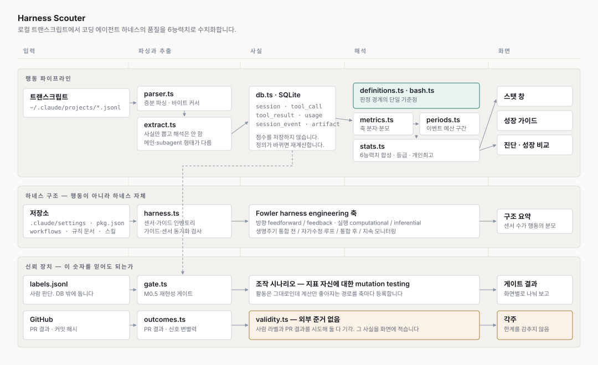

# Harness Scouter

로컬에 쌓인 Claude Code 트랜스크립트에서 **코딩 에이전트 하네스의 품질**을 6개 능력치로 수치화합니다. 리포트가 아니라 캐릭터 스테이터스 창처럼 보여주고, 낮은 능력치를 올리는 방법을 함께 냅니다.

측정 대상은 모델이 아니라 **하네스**입니다. 같은 모델을 써도 프롬프트·컨텍스트·훅·스킬을 어떻게 짰느냐에 따라 결과가 달라지는데, 그 차이를 재려는 도구입니다.

```
  HARNESS SCOUTER  전수 집계                          Lv. 73  B

  탐색력       █████████████░░░░░░░░░░░  53  C   통상 46~58  최고 67
      파일 찾기 규율 21   내용 인덱스 우선 44   근거 확보율 92
  검증력       ████████████████████░░░░  82  A   통상 74~89  최고 99
      커밋 전 검증 신선도 85   검증 공회전 없음 80
  완수력       ██████████████████████░░  91  S   통상 87~94  최고 99
  자율성       ██████████████████████░░  90  S   통상 84~97  최고 100
  규율         ████████████████░░░░░░░░  67  B   통상 69~77  최고 93
  컨텍스트 효율  ██████████████████░░░░░░  73  B   통상 68~79  최고 86

  종합 73.2 · B  (가장 가까운 등급 컷까지 4.8p)
```

## 아키텍처



세 갈래가 따로 돕니다.

**행동 파이프라인**은 트랜스크립트에서 사실만 뽑아 SQLite에 넣고, 점수는 매번 다시 계산합니다. 정의를 고칠 때 900MB를 재파싱하지 않으려는 구조입니다. `db.ts`에 점수가 없는 것이 그래서입니다.

**하네스 구조 스캔**은 저장소에서 센서와 가이드의 목록을 읽습니다. 행동만 봐서는 "차단 0건"이 센서가 좋아서인지 없어서인지 갈리지 않기 때문입니다. 축 이름은 Martin Fowler의 [harness engineering](https://martinfowler.com/articles/harness-engineering.html)에서 가져왔습니다.

**신뢰 장치**는 이 숫자를 믿어도 되는지를 잽니다. 재현성 게이트, 조작 시나리오, 타당성 상태가 여기 있습니다.

## 데이터

전부 로컬에 있습니다. 아무것도 밖으로 나가지 않습니다. 예외는 `scouter outcomes` 하나로, 이때만 `gh`로 GitHub에 PR 목록을 물어봅니다.

```
~/.claude/projects/**/*.jsonl   읽기 전용 입력. 890MB
~/.harness-scouter/scouter.sqlite   사실 테이블. 170MB
~/.harness-scouter/labels.jsonl     사람이 붙인 라벨
```

`--db`와 `--labels`로 위치를 바꿀 수 있습니다.

### SQLite를 쓰는 이유와 쓰는 방식

Node 22.5의 **내장 `node:sqlite`** 를 씁니다. `better-sqlite3` 같은 네이티브 모듈을 쓰면 VSCode 확장에서 Electron ABI 재빌드에 걸리는데, 내장 모듈은 그 문제가 없습니다. 그래서 의존성이 개발 도구뿐입니다.

DB에는 **파싱한 사실만** 들어갑니다. 점수는 없습니다.

| 테이블 | 담는 것 | 행 수(예) |
|---|---|---|
| `session` | 세션 메타. 프로젝트·브랜치·모델·진입점 | 424 |
| `tool_call` | 도구 호출. 이름·명령·파일 경로·차단 여부·에이전트 | 57,756 |
| `tool_result` | 도구 결과. 읽은 줄 수·편집 종류·stdout 꼬리 | 57,748 |
| `usage` | 응답당 토큰. 요청 단위로 중복 제거 | 46,241 |
| `session_event` | 중단·큐 개입·도구 거부 | 4,283 |
| `artifact` | 커밋·PR·커밋 해시 | 1,387 |
| `file_cursor` | 파일별 mtime과 바이트 위치 | 1,527 |

**축 점수를 저장하지 않는 것이 설계의 핵심입니다.** 지표 정의가 자주 바뀌는데, 정의를 고칠 때마다 890MB를 다시 파싱해야 하면 반복 주기가 무너집니다. 사실만 담아두고 축은 매번 계산합니다.

### 지워도 됩니다

DB는 언제든 버리고 다시 만들 수 있습니다. 트랜스크립트가 원본이고 DB는 파생물입니다.

```bash
rm ~/.harness-scouter/scouter.sqlite*
npm run scouter -- scan     # 890MB 전체 재파싱, 8초
```

증분 스캔은 파일별 mtime과 바이트 위치를 기억해서 새로 붙은 줄만 읽습니다. 바뀐 게 없으면 1초 안에 끝납니다.

**라벨은 DB 밖에 둡니다.** 라벨은 트랜스크립트에서 다시 뽑을 수 없는 유일한 입력인데, 파생물과 같은 그릇에 두면 정의를 한 번 고칠 때마다 사라집니다. `labels.jsonl`은 append-only라 쓰는 중 죽어도 앞의 것을 잃지 않고, 사람이 직접 열어 고칠 수 있습니다.

## 설치

Node 22.5 이상이 필요합니다. `node:sqlite` 내장 모듈을 쓰기 때문에 네이티브 의존성이 없습니다.

```bash
git clone <이 저장소>
cd harness-scouter
npm install
npm run build
```

`gh` CLI는 PR 결과를 볼 때만 필요합니다(`scouter outcomes`). 없어도 나머지는 다 돕니다.

## 사용

첫 실행은 스캔입니다. 이후에는 증분이라 몇 초면 끝납니다.

```bash
npm run scouter -- scan
# 파일 1,518개 중 1,518개 갱신 / 엔트리 310,802건 파싱 / 7.7초
```

### 능력치 보기

```bash
npm run scouter -- status --all   # 전수 집계
npm run scouter -- status         # 최신 구간만
```

`--all`은 모든 구간을 합쳐 "평소 어떤가"에 답하고, 없으면 최신 구간만 봐서 "지금 어떤가"에 답합니다.

### 올리는 방법 보기

```bash
npm run scouter -- guide --all
```

능력치마다 병목 구성요소를 짚고, 무엇을 세는지·왜 중요한지·올리는 행동·**점수만 오르고 품질은 안 오르는 안티패턴**을 냅니다.

### 어디서 새는지 보기

```bash
npm run scouter -- diag --all
```

큰 파일을 통째로 읽은 곳, 검증 없이 커밋된 곳, bash로 파일을 건드린 곳을 근거 세션과 함께 냅니다. 탐색 적시성(메인 대 subagent)도 여기 있습니다.

### 하네스 구조 보기

```bash
npm run scouter -- harness --root /path/to/repo
```

```
  센서 96개 (자동 88 · 수동 8) · 가이드 58개
  방향   feedforward 29  ·  feedback 67
  실행   computational 87  ·  inferential 9
  단계   통합 전 3  ·  자가수정 루프 53  ·  통합 후 33  ·  지속 모니터링 7

  가이드·센서 동기화   규칙 문서 323개에서 훅 27종 확인
    설명 없이 막는 게이트 4종: ...
```

### HTML로 보기

```bash
npm run scouter -- html --all --root /path/to/repo --out /tmp/scouter.html
```

육각형 레이더, 능력치 막대, 평가 기준표, 하네스 구조, 성장 가이드, 초기 대 최근 비교가 한 장에 들어갑니다. 뷰어의 밝고 어두운 테마를 모두 따릅니다.

### 그 밖

```bash
npm run scouter -- gate         # M0.5 재현성 게이트
npm run scouter -- outcomes     # PR 결과와 신호 변별력 (gh 필요)
npm run scouter -- periods      # 구간 목록
npm run scouter -- json         # 확장이 읽을 JSON
```

## 화면 읽는 법

### 능력치와 구성요소

| 능력치 | 묻는 것 | 구성요소 |
|---|---|---|
| 탐색력 | 찾아야 할 때 옳은 방법으로 찾나 | 파일 찾기 규율 · 내용 인덱스 우선 · 근거 확보율 |
| 검증력 | 주장 전에 확인하나 | 커밋 전 검증 신선도 · 검증 공회전 없음 |
| 완수력 | 산출물까지 도달하나 | 산출물 도달 · 재작업 없음 |
| 자율성 | 사람 개입 없이 완주하나 | 사람 개입 없음 |
| 규율 | 정한 규칙과 도구 경로를 지키나 | 계측 채널 준수 · 게이트 재발 없음 |
| 컨텍스트 효율 | 필요한 만큼만 읽고 토큰을 아끼나 | 읽기 범위 규율 · 읽은 것 기억하기 · 응답 간결성 · 컨텍스트 경량성 |

각 능력치는 구성요소의 평균입니다. 분모가 없는 구성요소는 빠집니다.

### 막대와 표시

```
탐색력   █████████████░░░░░░░░░░░  53  C   통상 46~58  최고 67
```

- **채운 막대**가 지금 값, **통상**은 내 이력의 p25~p75, **최고**는 개인 최고 기록입니다.
- **등급**은 전수 집계에서는 절대 점수, 구간별로는 내 이력 백분위입니다.
- HTML에서는 구성요소마다 `±` 표시가 붙습니다. 이력에서 그 값이 얼마나 덜 흔들렸는지이고, 클수록 믿을 만합니다.

목표를 **개인 최고**로 잡는 이유는 절대 임계를 만들 근거가 없어서입니다. 한 번 찍어본 값은 이 하네스로 도달 가능하다는 것이 데이터로 증명된 목표입니다.

### 평가 기준 — 남의 하네스에 쓸 수 있는가

구성요소마다 목표의 성격과 비교 가능성을 함께 냅니다.

| 목표 성격 | 뜻 |
|---|---|
| `100이 목표` | 못 채운 만큼이 그대로 결함. 절대 비교가 됩니다 |
| `높을수록 좋음` | 100을 목표로 둘 근거가 없습니다. 순위 비교만 뜻이 있습니다 |
| `양극단 주의` | 양쪽이 다 나쁠 수 있어 최대화 대상이 아닙니다. 종합에서 뺍니다 |

| 오염 플래그 | 뜻 |
|---|---|
| `훅 설치가 값을 움직임` | 차단된 호출이 축에서 빠져 방어를 깔수록 점수가 오릅니다 |
| `도구 이름에 묶임` | 이름이 다른 하네스에서는 그 활동이 계상에서 통째로 빠집니다 |
| `작업 구성에 좌우` | 사람이 아니라 그날 한 일을 잽니다 |

**오염 표시가 하나라도 있으면 사람 간 비교에 쓰지 않습니다.** 지금 그게 없는 것은 `근거 확보율` 하나뿐입니다.

## 설계에서 지킨 것

**사실과 해석을 분리합니다.** DB에는 파싱 결과만 담고 축은 매번 다시 계산합니다. 정의가 자주 바뀌기 때문입니다.

**판정 경계를 코드에 고정합니다.** 산문으로만 적었더니 같은 축을 재계산할 때마다 다른 값이 나왔습니다. 지금은 `definitions.ts`와 `bash.ts`가 단일 기준점이고 문서는 코드를 가리킵니다.

**조작 저항을 지표 자신에게 적용합니다.** 축마다 "활동은 그대로인데 계산만 좋아지는" 경로를 등록하고, 그 경로로 점수가 얼마나 오르는지 잽니다. 테스트에 대한 mutation testing과 같은 형태입니다. 시나리오마다 무엇이 물리적으로 그대로인지(불변량), 어느 함수의 어느 조건이 뚫리는지(메커니즘)를 적습니다.

**차단된 호출은 축에서 뺍니다.** 넣으면 게이트가 잘 작동할수록 점수가 나빠지는 역설이 생깁니다.

**한계를 감추지 않습니다.** 화면 각주에 외부 근거가 없다는 사실과 무엇을 시도해 기각했는지가 나갑니다.

## 알려진 한계

**외부 준거가 없습니다.** 이 점수가 실제 품질과 상관있다는 근거가 아직 없습니다. 두 번 시도해 두 번 기각했고 `validity.ts`에 수치와 함께 남겼습니다.

- **사람 라벨**: 세션마다 사람이 판정해야 해서 확장이 안 되고, 남의 하네스를 평가하려면 그 사람의 라벨이 필요합니다. 설계 단계에서 기각했습니다.
- **PR 결과**: 신호에 변별력이 없었습니다(머지 89%, 변경 요청 509건 중 2건). 사전 가설 3개 중 2개가 반대 방향으로 나왔고, 가장 큰 상관이 인과 경로가 없다고 사전 선언한 축에서 나왔습니다.

**재현성 게이트를 통과한 축이 적습니다.** 전수 집계 화면은 6축 중 2축, 구간별 화면은 1축이 뒷받침합니다. 나머지는 구간 안에서 점수가 재현되지 않습니다(split-half). 구간을 키워도 안정되지 않아 집계 단위의 문제가 아니라 세션 간 이질성으로 보입니다.

**구간 간 예측력이 0입니다.** 이웃 구간이 서로를 예측하지 않아 직전 구간 대비 변화를 표시하지 않습니다. 구간을 2·3·4배로 묶으면 오히려 내려갑니다.

**Claude Code 스키마에 묶여 있습니다.** 도구 이름(`Glob`·`Grep`·`Read`)과 결과 구조에 의존하므로 다른 하네스에 그대로 적용되지 않습니다.

## 개발

```bash
npm run build       # tsc --build
npm test            # vitest run
npm run typecheck
```

테스트 152건입니다. 정의를 고칠 때는 회귀 테스트를 함께 고치세요 — 값이 바뀌는 종류라 정적 검사로는 안 잡힙니다.

```
packages/core   파서·추출·사실 테이블·지표·구간·능력치·게이트·뷰
packages/cli    scouter 명령
packages/ext    VSCode 확장 (상태바·패널)
```
